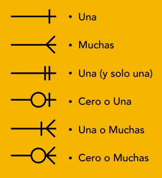
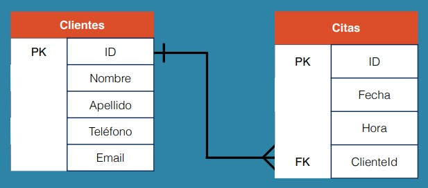

# Cardinalidad y Diagramas ER

## Cardinalidad

Se refiere al número máximo de veces que una instancia se relaciona con otra.

## Diagramas de Entidad / Relacion

- darán una idea de forma gráfica de las entidades (tablas) y sus atributos (columnas).
- ayudan a conocer como se relacionan los datos.

### Tipos de relaciones



### Diagrama ER

Estas son las tablas de una base de datos:

```Tabla de Clientes```

|Key|Atributos|
|---|---------|
|PK |ID       |
|   |Nombre   |
|   |Apellido |
|   |Teléfono |
|   |Email    |

```Tabla de Citas```

|Key|Atributos|
|---|---------|
|PK |ID       |
|   |Fecha    |
|   |Hora     |
|FK |ClienteID|

La tabla de citas contiene una Foreign Key la cual hace referencia a la Primary Key de la tabla de clientes.

Relacion de las tablas:



Con respecto a los tipos de relaciones vistos, el diagrama anterior muestra una relacion (cardinalidad) de uno a muchos, por lo tanto un cliente puede tener muchas citas.


El anterior diagrama contiene las siguientes relaciones:

- Un cliente puede tener muchas citas
- muchas citas pueden tener muchas CitasServicios (tabla pivote)
- muchas citasServicios pueden tener muchos servicios
