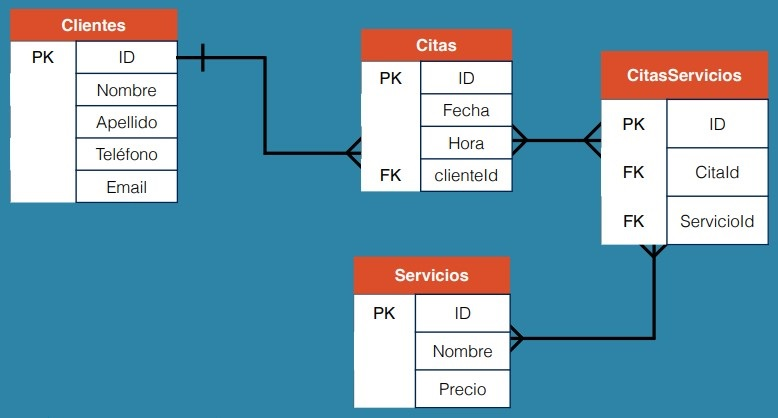

# Tabla Pivote

Es una tabla que agrupa datos procedentes de otras tablas

## Crear Tabla Pivote

Una tabla Pivote usualmente se llama como las tablas que unirá.



Con respecto al diagrama anterior, la tabla pivote es ```citasServicios``` ya que contiene la columna id de la tabla ```citas``` y la columna id de la tabla ```servicios```

### Comandos

Por lo tanto para crear una tabla pivote llamada ```citasServicios``` se crea una nueva tabla con las columnas que indica el diagrama. También hay que indicar que ```citaId``` y ```servicioId``` serán Foreign Keys, todo esto se hace con el siguiente codigo:

```shell
CREATE TABLE citasServicios (
id INT(11) AUTO_INCREMENT,
citaId INT(11) NOT NULL,
servicioId INT(11) NOT NULL,
PRIMARY KEY (id),
KEY citaId (citaId),
CONSTRAINT citas_FK
FOREIGN KEY (citaId)
REFERENCES citas (id),
KEY servicioId (servicioId),
CONSTRAINT servicios_FK
FOREIGN KEY (servicioId)
REFERENCES servicios (id)
);
```

## Consultar Info de una Tabla Pivote

En el caso de la tabla anterior, para consultar la información con respecto a las otras tablas se hace de la siguiente forma, usando LEFT JOIN:

```shell
SELECT * FROM citasServicios
LEFT JOIN citas ON citas.id = citasServicios.citaId
LEFT JOIN servicios ON servicios.id = citasServicios.servicioId;
```

Nos devolvería una tabla como la siguiente, pero en este caso no se conoce el valor de cliente por lo tanto se necesitaría hacer un JOIN dentro de un JOIN.

```shell
+----+--------+------------+------+------------+----------+-----------+------+-------------------------+--------+
| id | citaId | servicioId | id   | fecha      | hora     | clienteId | id   | nombre                  | precio |
+----+--------+------------+------+------------+----------+-----------+------+-------------------------+--------+
|  1 |      1 |          5 |    1 | 2023-05-03 | 10:00:00 |         1 |    5 | Peinado Hombre          |  60.00 |
|  2 |      1 |          2 |    1 | 2023-05-03 | 10:00:00 |         1 |    2 | Corte de Cabello Hombre |  80.00 |
|  3 |      1 |          3 |    1 | 2023-05-03 | 10:00:00 |         1 |    3 | Corte de Barba          |  60.00 |
+----+--------+------------+------+------------+----------+-----------+------+-------------------------+--------+
```

## Multiples Joins

En el caso del anterior problema se puede resolver ejecutando el siguiente codigo:

```shell
SELECT * FROM citasServicios
LEFT JOIN citas ON citas.id = citasServicios.citaId
LEFT JOIN clientes ON citas.clienteId = clientes.Id
LEFT JOIN servicios ON servicios.id = citasServicios.servicioId;
```

esto devolvería una tabla como la siguiente

```shell
+----+--------+------------+------+------------+----------+-----------+------+---------+----------+------------+-------------------+------+-------------------------+--------+
| id | citaId | servicioId | id   | fecha      | hora     | clienteId | id   | nombre  | apellido | telefono   | email             | id   | nombre                  | precio |
+----+--------+------------+------+------------+----------+-----------+------+---------+----------+------------+-------------------+------+-------------------------+--------+
|  1 |      1 |          5 |    1 | 2023-05-03 | 10:00:00 |         1 |    1 | Oswaldo | Chan     | 0123456789 | correo@correo.com |    5 | Peinado Hombre          |  60.00 |
|  2 |      1 |          2 |    1 | 2023-05-03 | 10:00:00 |         1 |    1 | Oswaldo | Chan     | 0123456789 | correo@correo.com |    2 | Corte de Cabello Hombre |  80.00 |
|  3 |      1 |          3 |    1 | 2023-05-03 | 10:00:00 |         1 |    1 | Oswaldo | Chan     | 0123456789 | correo@correo.com |    3 | Corte de Barba          |  60.00 |
+----+--------+------------+------+------------+----------+-----------+------+---------+----------+------------+-------------------+------+-------------------------+--------+
```
